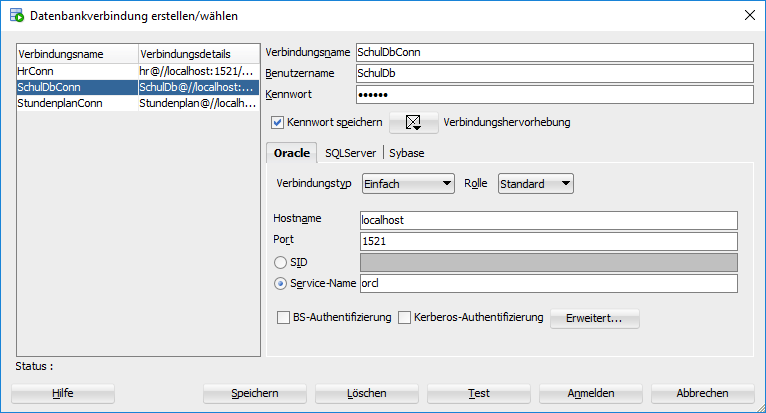

# Inhalte
## 2stündiger Block
- PL/SQL
    - Trigger
    - Procedures
    - Functions
- Joomla

## 3stündiger Block
- Datenbankadministration (Wintersemester)
    - Transactions
    - Index
    - Userrechte
    - Security
    - Analytische Funktionen
- Data Warehouse
    - Importschnittstellen in Oracle (SQL Loader)
- Business Intelligence mit SQL Server


# Download und Konfiguration der VM
Oracle ist ein Datenbankserver, der in unserem Falle in einer virtuellen Maschine läuft. Oracle stellt sogenannte Developer VMs bereit, um Erfahrungen mit der Datenbank zu sammeln. Auf <a href="http://www.oracle.com/technetwork/community/developer-vm/index.html" target="_blank">[Pre-Built Developer VMs (for Oracle VM VirtualBox)]</a> kann die VM *Database App Development VM* (am Besten im Browser auf der Seite danach suchen, es gibt viele VMs dort) bezogen werden, die unter anderen folgende Komponenten beinhaltet:

- Oracle Linux 7
- Oracle Database 12c Release 2 Enterprise Edition 
- Oracle SQL Developer 18.1
- Oracle SQL Developer Data Modeler

Die VM liegt im Open Virtualization Format (OVA) vor, am Einfachsten ist die Verwendung von Virtual Box als Virtualisierungssoftware.

Zum Starten der VM gehen Sie so vor:

1. Virtual Box von <a href="https://www.virtualbox.org/wiki/Downloads" target="_blank">[www.virtualbox.org]</a> laden und installieren. Dafür wählen Sie bei *VirtualBox 5.2.18 platform packages* (oder neuer) das Paket für *Windows hosts* (oder ein anderes Betriebssystem, wenn Sie z. B. unter OS X arbeiten). Bei der Installation können die Standardeinstellungen belassen werden.

1. Von `\\enterprise\ausbildung\unterricht\unterlagen\schletz\DBI_Stuff` können Sie sich Datei `DeveloperDaysVM2018-05-30_16.ova`(7.4 GB) laden. Unter dem oben beschriebenen Link auf oracle.com können Sie die VM ebenfalls beziehen, nur ist der Download recht langsam.

1. Nun müssen Sie die Virtuelle Maschine importieren. Durch Doppelklick öffnet sich automatisch Virtual Box mit dem Importidalog. Dort können Sie alles so lassen wie es ist, allerdings möchten Sie eventuell den Ort der vdm Dateien (virtuelle Harddisk) ändern. Das können Sie durch Eingabe eines neuen Pfades unter SATA Controller ganz unten im Importfenster. Nach dem Klick auf *Importieren* werden die virtuellen Harddisks erzeugt, was je nach Festplatte einige Minuten dauern kann.

1. Nun steht ihnen in Virtual Box die VM *Oracle DB Developer VM* zur Verfügung. Sie können diese nun starten. Falls eine Fehlermeldung, dass Intel VTx nicht aktiviert ist, erscheint, müssen Sie die dies im BIOS/UEFI Ihres Notebooks aktivieren. Je nach Modell ist dies anders möglich, suchen Sie einfach nach VTx und ihrem Notebookmodell im Internet nach einer Anleitung.

1. Unter *Applications* - *System Tools* - *Settings* können Sie bei *Region and Language* die Sprache, das Format und die Tastatur auf Germany einstellen.

Nach jeder Sitzung kann mit dem Befehl `poweroff` in der Konsole die VM sicher heruntergefahren werden.

Auf <a href="https://mikesmithers.wordpress.com/2015/01/25/installing-and-configuring-an-oracle-developer-day-virtualbox-image/" target="_blank">[mikesmithers.wordpress.com]</a> gibt es eine detaillierte Beschreibung der Konfigurationsmöglichkeiten.

# Installation von SQL Developer

SQL Developer ist zwar in der virtuellen Maschine integriert, eine Installation unter ihrem Hostbetriebssystem erlaubt allerdings ein flüssigeres Arbeiten. Dafür verbindet sich SQL Developer über TCP (Port 1521) zu Ihrer virtuellen Maschine, die natürlich laufen muss.

Das Port Forwarding in den Einstellungen der VM ist dafür zuständig, dass der Zugriff über localhost:1521 an die VM weitergeleitet wird. Sie können dies in Virtual Box jederzeit einsehen oder ändern: <a href="/pluginfile.php/123157/mod_label/intro/virtualBoxNat.png">[Bild]</a>

Sie können SQL Developer entweder direkt von der <a href="https://www.oracle.com/technetwork/developer-tools/sql-developer/downloads/index.html" target="_blank">[Downloadseite von Oracle]</a> laden, oder Sie kopieren sich die Datei *sqldeveloper-18.2.0.183.1748-x64.zip* vom Ordner `\\enterprise\ausbildung\unterricht\unterlagen\schletz\DBI_Stuff`. Die ZIP Datei muss nur entpackt und sqldeveloper.exe gestartet werden.

Zu Beginn verbinden wir uns als System User, um einen Benutzer einzurichten. Dazu klicken Sie auf das grüne Plus in der Palette Connections. Nun kann die Verbindung wie folgt eingerichtet werden:

* Verbindungsname: frei wählbar (s. B. *SystemConn*)
* Benutzername: *System*
* Kennwort: *oracle*
* Service-Name (statt SID): *orcl*

In das SQL Abfragefenster kopieren Sie folgende Befehle:
```
-- Nach IDENTIFIED BY kommt das Passwort, in unserem Fall oracle.
CREATE USER SchulDb IDENTIFIED BY oracle;
-- Nun bekommt der User alle Rechte 
GRANT CONNECT, RESOURCE, DBA TO SchulDb;
```

Nach dem Ausführen der Befehle (F5) ist der Benutzer SchulDb angelegt und kann auch als Verbindung hinzugefügt werden. Dazu klicken Sie wieder auf das grüne Plus in der Palette Connections. Nun kann die Verbindung wie folgt eingerichtet werden:

* Verbindungsname: frei wählbar (s. B. *SchulDbConn*)
* Benutzername: *SchulDb*
* Kennwort: *oracle*
* Service-Name (statt SID): *orcl*

Nach dem Klick auf Test und Save steht die neue Verbindung nun in der Palette Connections zur Verfügung. Ein Klick auf die Verbindung öffnet das Abfragefenster.


